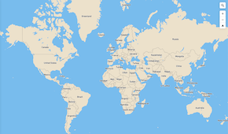
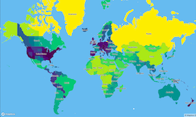
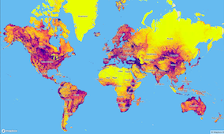

_Interactive web maps to **inspire** engagement with the natural world, **inform** scientific research, and **support** conservation action_

## Goals of the Outreach Platform

Bird the Gap is an outreach-oriented web mapping project to direct birdwatchers to locations currently underrepresented in crowdsourced data compiled by [eBird](https://ebird.org/about/) and the [Cornell Lab of Ornithology](https://www.birds.cornell.edu/home).

## Datasets

My sponsor, GIS Developer Tom Auer, and his team developed two statistical models to identify geographic gaps in data contributed from citizen scientists around the world in 2018.

The resulting two sets of raster data demonstrate (1) a relative measure of **data sufficiency** in a region, and (2) the **probability** of receiving data from a given habitat configuration.

## Map Prototypes

The scalable prototypes use Mapbox [Mapbox](https://www.mapbox.com/) and its JavaScript library [Mapbox GL JS](https://docs.mapbox.com/mapbox-gl-js/api/) to visualize data from the week of July 6, 2018. Each prototype includes one Mapbox base layer and two custom layers:

**Mapbox base layer**

**data sufficiency layer**

**probability layer**

## Prototype View Options

**These maps are best viewed in a desktop browser, as media rules have not yet been defined.**

### Zoom Switch

In this prototype, custom layers are controlled by zoom level. The data sufficiency layer is visible first. As the user zooms in, the map switches to reveal the probability.

To view the zoom switch prototype, please open this page in a desktop browser and click [here](https://ekamoe.github.io/zoom-switch/).

### Radio Toggle

This prototype contains radio buttons that allow the user to toggle between three custom styles. When the map loads, the user will see the same map as the Zoom Switch prototype. The user can toggle to view only one layer at a time.

To view the radio toggle prototype, please open this page in a desktop browser and click [here](https://ekamoe.github.io/radio-toggle/).

### Full documentation coming soon.

