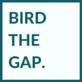

## Goals of the Outreach Platform

Bird the Gap is an outreach-oriented web mapping project to direct birdwatchers to locations currently underrepresented in crowdsourced data compiled by [eBird](https://ebird.org/about/) and the [Cornell Lab of Ornithology](https://www.birds.cornell.edu/home).

## Datasets

My sponsor, GIS Developer Tom Auer, and his team developed two statistical models to identify geographic gaps in data contributed from citizen scientists around the world in 2018.

The resulting two sets of raster data demonstrate (1) relative **data sufficiency** to model abundance by administrative regions, and (2) the **probability** of receiving data from a given pixel (or habitat configuration).

## Prototypes

The scalable prototypes use Mapbox and its JavaScript library to visualize data from the week of July 6, 2018. Each prototype includes Mapbox's base layer components, such as administrative boundaries and points of interest. These maps are best viewed in a desktop browser.

### Zoom Switch Lightweight

In this prototype, both sets of raster data are included in one map. The user first sees the data sufficiency layer. As the user zooms in, the map switches to reveal the probability. This prototype requires only one map load, making it the lighter weight, less expensive option.

[Zoom Switch Lightweight Prototype](https://ekamoe.github.io/zoom-switch-lightweight/)

### Toggle Heavyweight

This prototype contains radio buttons that allow the user to toggle between three custom styles. When the map loads, the user will see the same map as the lightweight prototype. The user can then toggle to view only one layer at a time: data sufficiency only or probability only. This version requires three map loads each time the webpage is open. Right now, there are no zoom constraints on these maps; my stretch goal is to have the newly-selected view "jump back" to a wider starting zoom level.

[Toggle Heavyweight Prototype](https://ekamoe.github.io/toggle-heavyweight/)

#### Full documentation coming soon.
