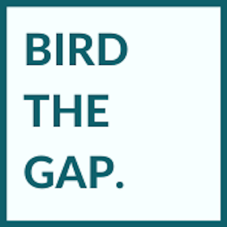

# Bird the gap.

### A capstone project by MLIS candidate Ellen Namakaokealoha Kamoe, created with [eBird](https://ebird.org/about) and the [Cornell Lab of Ornithology](https://www.birds.cornell.edu/home).

# Interactive web maps to inspire engagement with the natural world, inform scientific research, and support conservation action

